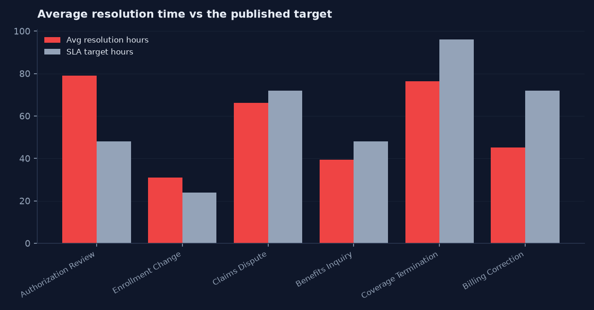
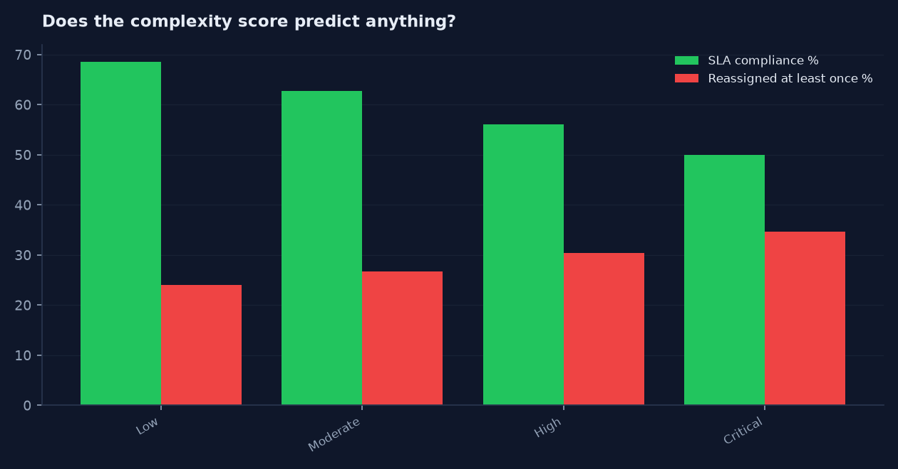
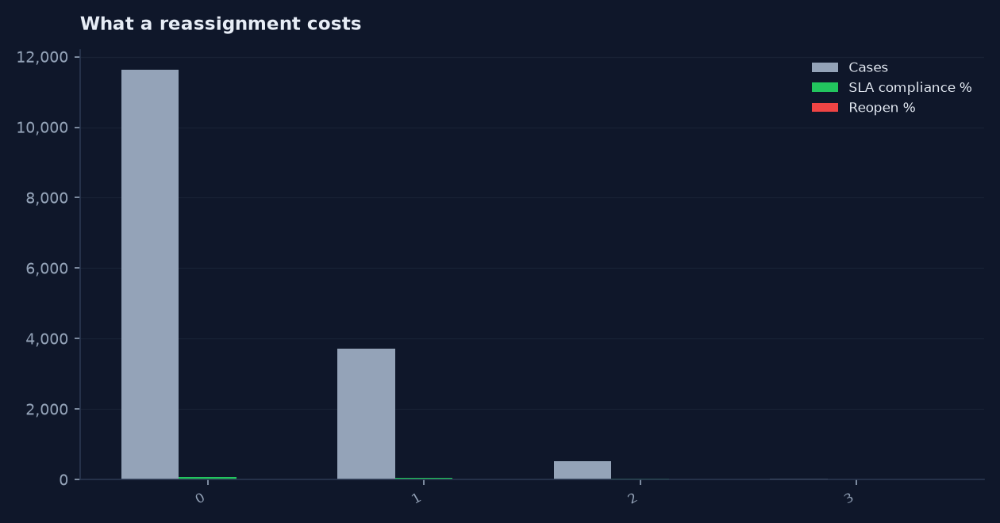

# Case Assignment Fairness and SLA Control Tower

A business-analysis and analytics case study for **ClearPath Case Services**, a
fictional third-party administrator that resolves member and provider case work
on behalf of health plans. Five teams, 35 analysts, six months of case history.

**Live dashboard: [https://careersahrafanousi-debug.github.io/case-assignment-fairness/dashboard/](https://careersahrafanousi-debug.github.io/case-assignment-fairness/dashboard/)**

Built by [`src/build_dashboard.py`](src/build_dashboard.py) from the query set in
[`dashboard/dashboard_config.json`](dashboard/dashboard_config.json), run against `data/cases.db`.
Every number on the page comes out of a SQL query held in that config file, so the page
cannot drift away from the analysis in [`sql/`](sql/) — regenerate it with
`python src/load_sqlite.py && python src/build_dashboard.py`. Chosen over a `.pbix`
because a reviewer can open a URL and cannot open a binary.

## Built in four tools, from one set of queries

The 15 SQL queries in [`dashboard/dashboard_config.json`](dashboard/dashboard_config.json)
are the single definition of every number in this repository.
[`src/build_bi_assets.py`](src/build_bi_assets.py) runs them once and emits every
artifact below, so none of them can disagree with each other or with
[`sql/`](sql/). Change a query, rerun, and all four change together.

| Folder | What is in it | Open it with |
|---|---|---|
| [`dashboard/`](dashboard/) | Interactive HTML dashboard, [live here](https://careersahrafanousi-debug.github.io/case-assignment-fairness/dashboard/) | Any browser, nothing to install |
| [`excel/`](excel/) | `case-assignment-fairness_dashboard.xlsx` — native Excel charts over `q_*` query sheets | Excel, LibreOffice, Sheets |
| [`tableau/`](tableau/) | `case-assignment-fairness.twb` — Tableau workbook as reviewable XML | Tableau Desktop or Public |
| [`powerbi/`](powerbi/) | Semantic model in TMDL (18 files) and TMSL, plus 26 DAX measures | Power BI Desktop, Tabular Editor |
| [`charts/`](charts/) | Static PNG renders of the headline findings | Nothing — they are below |
| [`bi_extracts/`](bi_extracts/) | 15 tidy CSV outputs, the shared source for Tableau and Power BI | Anything |

Rebuild everything:

```
python src/generate_data.py
python src/load_sqlite.py
python src/build_dashboard.py
python src/build_bi_assets.py
```

No `.pbix`, `.twbx`, or other binary workbook is committed anywhere. They cannot
be diffed, reviewed in a pull request, or opened without a licence, and they
carry a second copy of the data that drifts away from `data/`. The text formats
above give the same result and stay reviewable. Each folder's `README.md`
explains its own trade-offs, including what has and has not been round-tripped
through the vendor tool.

### Headline charts








The question the business actually asked was "which team is underperforming?"
The analysis answered a better one: **is work being distributed and routed in a
way that makes the SLA achievable at all?**

> This project uses fully synthetic data created for educational and portfolio
> purposes. It does not use employer data, patient information, protected health
> information, or confidential business information.

---

## Business problem

ClearPath reports a single blended SLA compliance number to its health-plan
clients each month. It has sat between 61% and 64% for six straight months and no
intervention has moved it. Leadership's working theory was that one team was
dragging the average down and needed coaching.

Two things made that theory untestable with the reporting available:

1. There was no measure of how *hard* the work in each queue was, so a team with
   heavier cases looked worse than a team with easier ones and no one could say
   whether that was performance or mix.
2. There was no measure of routing quality. Cases that bounced between analysts
   before landing in the right place still counted as a single case.

This project builds the three measures needed to separate those effects, then
uses them to test the coaching theory. The theory does not survive.

## Stakeholders

| Stakeholder | Interest |
|---|---|
| VP, Case Operations | Wants the blended SLA number to move; owns the intervention budget |
| Team Managers (5) | Accountable for their team's SLA; need to know if the measure is fair |
| Workforce Planning | Owns headcount allocation across the five teams |
| Client Reporting | Publishes the monthly SLA figure to health-plan clients |
| Data Governance | Owns definitions and the quality of the case record |

## Scope and assumptions

**In scope.** Cases created 2026-01-02 through 2026-06-30. Five teams, 35
analysts, six case types with published SLA targets between 24 and 96 hours.
Assignment, reassignment, resolution, reopen and root-cause data.

**Out of scope.** Individual performance management. Client contract terms.
Cost, staffing cost, or headcount modelling. Anything requiring a system change
to capture new fields.

**Assumptions.**
- Headcount per team did not change during the six months, so a workload index
  computed over the full period is comparable across teams.
- SLA is measured in elapsed clock hours from case creation to resolution. The
  source system does not record business hours, so business-hour SLA cannot be
  reproduced. This is documented as defect D-02, not worked around.
- The stored `SLA_Met` flag is never trusted. It is recalculated from dates on
  every run.
- A reassignment is treated as a routing failure. That is a simplification: some
  reassignments are legitimate escalations. See Limitations.

## Data source statement

All data is generated by `src/generate_data.py` with a fixed seed (8821), so every
number in this README reproduces exactly. Organisation, team, analyst, payer and
case identifiers are invented. The generator deliberately injects realistic
defects — duplicate case IDs, single-letter SLA codes, resolved cases with no
resolution date, out-of-range reassignment counts, statuses that are not in the
approved list — so the data-quality layer has something real to catch.

## Data model

Star schema, one fact table:

- `case_data` (fact, 15,908 rows) — one row per case, with derived complexity
  score, recalculated SLA outcome, and the three timing measures.
- `dim_team` (5) — team, primary capability, analyst count, hours per analyst day.
- `dim_analyst` (35) — analyst, team, tenure band.
- `dim_case_type` (6) — case type and its published SLA target hours.
- `dim_date` (180) — calendar spine.
- `team_capacity` (900) — team by day: available hours, new cases, open backlog,
  backlog work hours.
- `team_workload` (5) — the Workload Balance Index output.
- `dq_exceptions` (577) — every rule violation, its severity and what was done.

## Data quality approach

Sixteen rules run in `src/clean_and_score.py`. Each violation is written to
`data/clean/dq_exceptions.csv` with a severity and an action. **Critical failures
are excluded from reporting and logged. They are never silently corrected**,
because a resolved case with no resolution date cannot be given a plausible date
without inventing the answer the analysis is meant to produce.

| Result | Value |
|---|---|
| Cases in | 16,055 |
| Cases out | 15,908 |
| Exceptions logged | 577 |
| Records excluded | 92 |
| **Data Quality Score** | **99.43%** |

Exceptions by rule:

| Rule | Severity | Action | Count |
|---|---|---|---|
| DQ-13 | Low | Normalized, record retained | 158 |
| DQ-14 | Medium | Set to Not Recorded | 140 |
| DQ-02 | Low | Normalized, record retained | 120 |
| DQ-01 | High | First occurrence retained | 55 |
| DQ-07 | Critical | Excluded from reporting | 34 |
| DQ-06 | Critical | Excluded from reporting | 26 |
| DQ-09 | Critical | Excluded from reporting | 17 |
| DQ-03 | Critical | Excluded from reporting | 15 |
| DQ-12 | High | Set to null; excluded from routing accuracy | 12 |

Full definitions in [docs/07_data_quality_rules.md](docs/07_data_quality_rules.md).

## KPI definitions

**Case Complexity Score (0–100).** Weighted sum, banded:

```
30  Case type weight      (Coverage Termination 30 ... Enrollment Change 9)
25  Priority weight       (Urgent 25, High 19, Standard 11, Low 5)
20  Documentation gap present
15  Policy exception required
10  Historical rework risk on this case
```

Bands: Low 0–29, Moderate 30–54, High 55–74, Critical 75–100.

**Workload Balance Index.** Team weighted workload ÷ average weighted workload,
where weighted workload is the total complexity score the team handled divided by
its available analyst hours. Below 0.85 underutilized, 0.85–1.15 balanced, above
1.15 overloaded.

**Assignment Accuracy Rate.** Cases resolved without reassignment ÷ total cases
with a valid reassignment count × 100. The 12 records with an out-of-range
reassignment count are excluded from the denominator rather than counted as zero.

Complete definitions, including every edge case, in
[docs/03_data_dictionary.md](docs/03_data_dictionary.md).

## Analysis approach

`sql/06_sql_analysis.sql` holds 18 queries against SQLite. They move from the
headline control-tower figures, to SLA by case type and priority, to workload
equity, to routing accuracy by method, to the cost of a reassignment, to root
cause and rework, and finally to the open-case priority queue. Two queries exist
purely to test whether an effect is real: one checks whether customer segment
predicts service level, one checks whether tenure does.

Run order:

```bash
pip install -r requirements.txt
python src/generate_data.py
python src/clean_and_score.py
python src/load_sqlite.py
sqlite3 data/cases.db < sql/06_sql_analysis.sql
```

## Dashboard

No `.pbix` is committed. A binary Power BI file cannot be reviewed or diffed on
GitHub and would be the least trustworthy artifact in the repo. Instead
[docs/10_dashboard_spec.md](docs/10_dashboard_spec.md) gives the full model,
relationships, DAX for every measure, and a page-by-page layout for five pages:
SLA Control Tower, Workload Equity, Routing Accuracy, Priority Queue, and Root
Cause & Rework. It is buildable directly from `data/cases.db`.

## Findings

**Headline.** 15,908 cases, 15,714 resolved, 194 open. SLA compliance 62.70%.
Assignment Accuracy Rate 73.10%. Reopen rate 6.47%. Average resolution 52.7
hours, median 43.0. Average lag from creation to assignment 2.48 hours.

**1. The coaching theory does not hold.** No team is overloaded in any serious
sense, yet SLA compliance ranges from 25.88% to 84.19% — a 58 point spread.

| Team | Capability | Analysts | Cases | Avg complexity | Balance Index | Status | SLA % | Assignment accuracy % | Median hours |
|---|---|---|---|---|---|---|---|---|---|
| TEAM-04 | Authorization | 5 | 2,303 | 44.9 | 1.099 | Balanced | 25.88 | 73.81 | 71.0 |
| TEAM-03 | Enrollment | 6 | 2,912 | 33.8 | 0.871 | Balanced | 49.02 | 73.00 | 27.5 |
| TEAM-02 | Claims | 7 | 3,068 | 48.3 | 1.125 | Balanced | 65.73 | 72.76 | 54.8 |
| TEAM-01 | Benefits | 9 | 4,965 | 40.6 | 1.190 | Overloaded | 74.29 | 73.51 | 39.3 |
| TEAM-05 | Billing | 8 | 2,660 | 40.4 | 0.715 | Underutilized | 84.19 | 72.22 | 38.5 |

The only team the index flags as overloaded, TEAM-01, has the *second best* SLA.
The worst performer by SLA, TEAM-04, sits inside the balanced band. Workload
volume per head does not explain the spread, and the four teams' Assignment
Accuracy Rates are within 1.6 points of each other — so it is not analyst skill
either. Whatever is happening to TEAM-04 is structural.

**2. TEAM-04's problem is the target, not the team.** TEAM-04 handles
Authorization Review, which carries a 48-hour SLA but averages 79.0 hours to
resolve. Across all teams, Authorization Review compliance is 26.37% — almost
identical to TEAM-04's overall 25.88%, because it is nearly all TEAM-04 does. The
target was set without reference to how long the work takes.

| Case type | SLA target (h) | Cases | SLA % | Avg resolution (h) | Avg breach (h) |
|---|---|---|---|---|---|
| Authorization Review | 48 | 2,193 | 26.37 | 79.0 | 46.6 |
| Enrollment Change | 24 | 2,843 | 44.69 | 30.9 | 18.4 |
| Claims Dispute | 72 | 3,064 | 65.86 | 66.2 | 34.0 |
| Benefits Inquiry | 48 | 3,810 | 73.59 | 39.4 | 21.7 |
| Coverage Termination | 96 | 1,417 | 74.62 | 76.4 | 37.9 |
| Billing Correction | 72 | 2,581 | 86.89 | 45.1 | 24.4 |

Authorization Review and Enrollment Change are the only two types whose average
resolution time exceeds their own target. Both are the two lowest performers.
Authorization Review alone accounts for 73,906 of the 180,810 total breach hours
in the period — 41% of all lateness from 14% of cases.

**3. Auto-routing is the largest controllable driver.** Auto-routing handles 58%
of volume and is the least accurate method by a wide margin.

| Routing method | Cases | Assignment accuracy % | Avg reassignments | Avg lag (h) | SLA % | Reopen % |
|---|---|---|---|---|---|---|
| Auto-Routed | 9,297 | 66.77 | 0.387 | 1.24 | 62.88 | 7.00 |
| Analyst Self-Select | 1,947 | 77.69 | 0.249 | 6.00 | 59.70 | 6.16 |
| Manual Triage | 4,664 | 83.83 | 0.173 | 3.47 | 63.58 | 5.53 |

Manual triage is 17.1 points more accurate than auto-routing and reopens 1.5
points less often. It pays for that with 2.2 extra hours of assignment lag — a
trade worth making, because a reassignment costs far more than two hours:

| Reassignments | Cases | Avg resolution (h) | SLA % | Reopen % |
|---|---|---|---|---|
| 0 | 11,620 | 46.3 | 70.33 | 4.41 |
| 1 | 3,705 | 67.1 | 44.18 | 12.15 |
| 2 | 533 | 88.4 | 27.06 | 11.82 |
| 3 | 34 | 110.6 | 12.90 | 8.82 |

One reassignment adds 20.8 hours and drops SLA compliance by 26.2 points. It also
nearly triples the reopen rate, 4.41% to 12.15%, which is the more expensive
number because reopened work is paid for twice.

**4. The complexity score behaves, but weakly.** Moving from Low to Critical
band, SLA compliance falls 68.58% → 62.69% → 56.07% → 50.00% and the share of
cases reassigned at least once rises 24.03% → 34.70%. Monotonic in the right
direction, which is the most that can be claimed for weights that were assigned
by judgement rather than fitted. The gradient is not steep enough to use the
score as a routing rule on its own.

**5. Documentation gaps are the single largest root cause.** Missing
documentation accounts for 4,090 resolved cases (26.0%) at 59.5 average hours and
54.72% SLA. Incorrect initial routing accounts for another 2,282 (14.5%) and
carries the worst reopen rate of any cause at 8.41%.

**6. Two null findings, reported because they were tested.** Customer segment does
not predict service level — Enterprise 62.00%, Small Group 62.19%, Mid-Market
63.31%, Individual 63.32%, a 1.3 point spread on materially identical average
complexity. There is no evidence of segment favouritism. Tenure has a real but
modest effect: 0–1 year analysts 57.60% SLA, 1–3 year 62.35%, 3+ year 65.75%. An
8.2 point tenure gap is worth onboarding attention but does not explain a 58
point team gap.

**7. Backlog days of work exposes the real capacity picture.** Dividing backlog
work hours by available hours, TEAM-04 carries 8.74 days of queued work and
TEAM-02 8.48, against 2.65 for TEAM-03. TEAM-04 is not handling more cases — it is
handling cases that sit in a queue for over a week before anyone can start them.
This is the finding the Workload Balance Index misses, and the reason the index
is published next to backlog days rather than instead of it.

## Recommendations

1. **Re-baseline the Authorization Review SLA before coaching anyone.** At a
   26.37% compliance rate against an average resolution time 65% above target,
   the target is not a stretch goal, it is a number nobody has ever hit.
   Recommend either a 96-hour target consistent with Coverage Termination, or a
   two-stage target that stops the clock while waiting on external authorization.
   Renegotiating a client SLA is a commercial decision, so this is a
   recommendation to the VP, not a change to make in the reporting layer.
2. **Route the highest-risk case types through manual triage.** Applying manual
   triage's 83.83% accuracy to Authorization Review and Claims Dispute volume
   instead of auto-routing's 66.77% is a modeled opportunity of about 518 fewer
   first-time misroutes over six months (3,035 auto-routed cases in those two
   types × a 17.06 point accuracy gap). Given that one reassignment costs 20.8
   hours and triples reopen risk, that is the highest-value lever available. The
   figure is an expected impact subject to validation, not a savings claim — the
   two populations differ in more than routing method.
3. **Stop publishing a single blended SLA number.** A 58 point spread across
   teams with materially equal workload indices means the blended figure hides
   every actionable signal. Report by case type against its own target, with the
   Workload Balance Index and backlog days of work alongside it.
4. **Attack documentation gaps at intake, not at resolution.** 26% of resolved
   cases cite missing documentation. A required-fields gate at intake is a
   process change, not an analytics change, and it is where the largest single
   root cause lives.
5. **Fix the two measurement defects first.** Business-hour SLA cannot be
   computed (D-02) and 140 resolved cases have no root cause recorded (D-03).
   Neither is expensive to fix and both limit every recommendation above.

## Future-state workflow

The to-be process adds four controls: a required-fields gate at intake, a triage
step that routes High and Critical complexity cases to manual triage, a
reassignment reason code, and a weekly workload equity review that looks at the
Balance Index and backlog days together. See
[docs/09_to_be_process_map.md](docs/09_to_be_process_map.md).

## Limitations

- **Synthetic data, so causality is built in.** The generator was written to make
  auto-routing reassign more often. The analysis measures that relationship
  correctly, but it does not prove the relationship exists in any real operation.
  What is transferable is the method, not the conclusion.
- **Complexity score weights are analyst judgement, not fitted.** They were not
  regressed against outcomes. The score is monotonic against SLA and reassignment
  rate, which is evidence it is not nonsense, not evidence it is right.
- **Reassignment treated as failure.** Some reassignments are legitimate
  escalations. Without a reason code the two cannot be separated, so Assignment
  Accuracy Rate overstates the failure rate by an unknown amount.
- **Elapsed-hour SLA, not business-hour.** Because the source has no business
  calendar, a case created Friday afternoon is penalised for the weekend. This
  biases compliance downward and the bias is not uniform across case types.
- **No cost or savings figures.** Recommendation 2 is expressed as fewer
  misroutes, not as dollars, because no rate data exists in this dataset and
  inventing one would be the least defensible thing in the repo.
- **No `.pbix`.** The dashboard is built — as a live HTML page at
  [https://careersahrafanousi-debug.github.io/case-assignment-fairness/dashboard/](https://careersahrafanousi-debug.github.io/case-assignment-fairness/dashboard/), generated from SQL by `src/build_dashboard.py`. The
  Power BI implementation remains a specification rather than a binary, which is deliberate
  and explained above.
- **The Workload Balance Index is period-level.** An earlier version computed it
  on open cases only; with a 43-hour median resolution the open backlog is 194
  cases across five teams and the index swung on a handful of records. The
  period-level version is stable but cannot detect a short-lived spike.

## HIPAA and privacy statement

This project uses fully synthetic data created for educational and portfolio
purposes. It does not use employer data, patient information, protected health
information, or confidential business information. No real organisation, team,
analyst, member or payer appears anywhere in this repository. Analyst-level
results are reported by tenure band rather than by individual, matching the
practice a real operation should follow when publishing performance data. See
[docs/PRIVACY.md](docs/PRIVACY.md).

## Repository layout

```
data/raw/          generated source extracts (CSV + XLSX)
data/clean/        cleaned fact table, team workload, DQ exception log
data/cases.db      SQLite database (gitignored, rebuild with load_sqlite.py)
docs/              charter, requirements, dictionary, DQ rules, process maps,
                   dashboard spec, UAT cases, executive summary
sql/               18 analysis queries
src/               generator, cleaner and scorer, SQLite loader
```

## Documentation

| Doc | Contents |
|---|---|
| [01_project_charter.md](docs/01_project_charter.md) | Problem, objectives, scope, risks |
| [02_business_requirements.md](docs/02_business_requirements.md) | 24 requirements with acceptance criteria |
| [03_data_dictionary.md](docs/03_data_dictionary.md) | Every field and every KPI definition |
| [07_data_quality_rules.md](docs/07_data_quality_rules.md) | 16 rules, severities, results |
| [08_as_is_process_map.md](docs/08_as_is_process_map.md) | Current process with pain points |
| [09_to_be_process_map.md](docs/09_to_be_process_map.md) | Future process with controls |
| [10_dashboard_spec.md](docs/10_dashboard_spec.md) | Model, DAX, five page layouts |
| [11_uat_test_cases.md](docs/11_uat_test_cases.md) | 22 test cases with expected results |
| [12_executive_summary.md](docs/12_executive_summary.md) | One page for leadership |
| [PRIVACY.md](docs/PRIVACY.md) | Privacy and synthetic-data statement |
