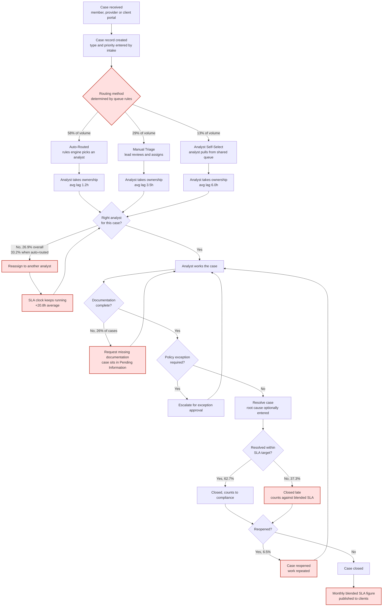

# As-Is Process Map

Current case intake, routing and resolution at ClearPath Case Services.

## Pain points

| # | Where | Pain point | Evidence |
|---|---|---|---|
| P-1 | Routing decision | Routing method is decided by queue rules, not by case difficulty. The least accurate method carries the most volume | Auto-routing handles 9,297 cases at 66.77% accuracy; manual triage handles 4,664 at 83.83% |
| P-2 | Reassignment loop | The SLA clock does not stop on reassignment, so a routing error is charged to the analyst who inherits it | One reassignment adds 20.8 hours and drops SLA compliance 26.2 points |
| P-3 | Reassignment loop | No reason code, so nobody can tell an escalation from a misroute | Defect D-01 |
| P-4 | Documentation request | Documentation is checked after assignment, not at intake, so the case is already on the clock when the gap is found | Missing documentation is the largest root cause at 4,090 resolved cases, 26.0% |
| P-5 | SLA evaluation | Targets were set without reference to how long the work takes | Authorization Review averages 79.0h against a 48h target; Enrollment Change 30.9h against 24h |
| P-6 | Reopen loop | Reopened work is invisible in the SLA measure — the original close still counts | 6.47% reopen rate overall, 12.15% on reassigned cases |
| P-7 | Reporting | A single blended figure across five teams and six targets hides every actionable signal | 58 point SLA spread across teams, 60.5 point spread across case types |
| P-8 | Reporting | The stored SLA_Met flag is unreliable, so reporting cannot be taken at face value | 158 single-letter codes; flag never used, always recalculated |
| P-9 | Queue management | No visibility of queue time, only of volume | TEAM-04 carries 8.74 days of queued work while sitting inside the balanced workload band |

## What the map makes obvious

The reassignment loop is the only place in the process where work is repeated at
full cost with no record of why. It is entered 26.9% of the time, it is entered
most often from the routing path that carries the most volume, and its cost lands
on a measure that is reported to clients. Every other pain point is either
downstream of it or a reporting problem.
