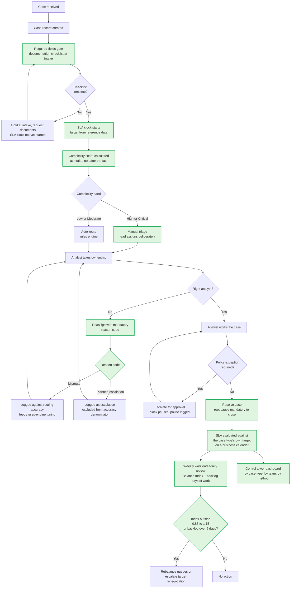

# To-Be Process Map

Future state. Four new controls, all buildable without a new source system.

## Controls introduced

| # | Control | Pain addressed | Expected effect |
|---|---|---|---|
| C-1 | Required-fields gate at intake, with the SLA clock starting only once the checklist passes | P-4, P-5 | Removes the largest root cause from the measured clock. Missing documentation drives 26.0% of resolved cases at 59.5 average hours |
| C-2 | Complexity score calculated at intake, used to select the routing path | P-1 | Routes the 3,088 High and Critical cases through the 83.83% accurate method instead of the 66.77% one. Modeled opportunity, subject to validation |
| C-3 | Mandatory reassignment reason code, splitting misroutes from planned escalations | P-2, P-3 | Makes Assignment Accuracy Rate a true measure instead of an upper bound on failure. Closes defect D-01 |
| C-4 | Root cause mandatory to close, plus a business calendar for SLA evaluation | P-6, P-8 | Closes defects D-02 and D-03. Makes the 140 unexplained resolutions impossible |
| C-5 | Weekly workload equity review using the Balance Index **and** backlog days of work together | P-9, P-7 | Would have surfaced TEAM-04's 8.74 days of queued work, which the index alone scores as balanced |
| C-6 | Reporting by case type against its own target, replacing the blended figure | P-7 | Exposes the 60.5 point spread between Authorization Review and Billing Correction that the blended 62.70% conceals |

## Sequencing

C-3 and C-4 are data-capture changes and should go first: they are cheap, they
close three defects, and every other control's measurement depends on them. C-6 is
a reporting change with no system dependency and can run in parallel. C-1 and C-2
are process changes affecting analyst behaviour and should follow, once C-3 makes
their effect measurable. C-5 is the governance routine that keeps the rest honest.

## What this does not fix

Re-baselining the Authorization Review SLA is not in this map, because it is a
commercial negotiation with a client rather than an internal process change. It
remains the single largest contributor to the gap — 73,906 of 180,810 total breach
hours — and no amount of process improvement closes a target that sits 65% below
the average time the work actually takes.
